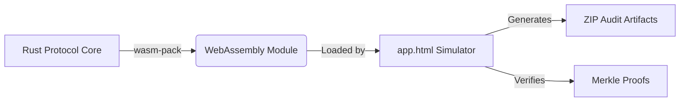

# GreyMisnomer

> **A zero-trust, immutably-auditable carbon credit registry that runs entirely in the browser.**

GreyMisnomer solves the opacity and double-counting issues in voluntary carbon markets by moving the core registry logic—including Merkle proofs, invariants, and credit batching—into a cryptographically verifiable WebAssembly module.

## ⚡ Try it Live
**[Open the Interactive Simulator](https://greymisnomer.github.io/GreyMisnomer/)**

The entire 7-step protocol (MRV data upload → Merkle Commitment → Minting → Transfer → Partial Retirement → Audit Export) is available to test directly in your browser. **No backend or database is required.**

---

## 🏗 Architecture

GreyMisnomer moves the state machine out of a trusted backend and into the client browser:



1. **Rust Library (`grey-misnomer-core`)**: Implements the strict RFC invariants, BLAKE3 hashing, and supply arithmetic.
2. **WASM Bindings (`grey-misnomer-wasm`)**: Exposes the Rust state machine to JavaScript.
3. **Web Interface (`docs/app.html`)**: A 100% client-side simulator where project developers can walk through the lifecycle of a carbon credit and export their cryptographic proofs as JSON/PDF artifacts.

---

## 🚀 Quick Start (Local Development)

If you want to run the simulator locally and compile the Rust protocol yourself:

**Prerequisites:**
- Rust (`rustup default stable`)
- `wasm32-unknown-unknown` target
- `wasm-pack`
- Node.js (for `http-server`)

**1. Clone the repository**
```bash
git clone https://github.com/PrabhatKarlekar/GreyMisnomer.git
cd GreyMisnomer
```

**2. Build the WASM module**
```bash
cd src/wasm
wasm-pack build --target web --out-dir ../../docs/pkg --out-name grey_misnomer_wasm
```

**3. Serve the web app**
```bash
cd ../../docs
npx http-server -p 8080 --cors -c-1
```
Open `http://localhost:8080` in your browser.

---

## 📜 Invariants Enforced
The WASM core mathematically prevents:
- **Replay attacks**: A Proof-of-Integrity (PoI) can only be minted into credits exactly once.
- **Supply inflation**: Minted amounts must exactly match the length of the serial number range.
- **Double spending**: Credit transfers and retirements track precise serial slices; you cannot transfer overlapping ranges.
- **Tampering**: All MRV (Measurement, Reporting, and Verification) sensor data is committed to a BLAKE3 Merkle tree before minting.

---

## 📂 Project Structure
- [`src/`](./src/) — Rust protocol core (`grey-misnomer-core`) and WASM bindings (`grey-misnomer-wasm`).
- [`docs/`](./docs/) — The static WebAssembly front-end and interactive simulator.
- [`architecture/`](./architecture/) — Protocol design documents and system architecture.
- [`research/`](./research/) — Background research and RFCs on digital carbon markets.
- [`tests/`](./tests/) — Integration and unit tests for the core registry logic.
- [`governance/`](./governance/) — Policy and governance frameworks.
- [`roadmap/`](./roadmap/) — Future project milestones and features.

---

*GreyMisnomer – Open Source • Verifiable • Evolving*
