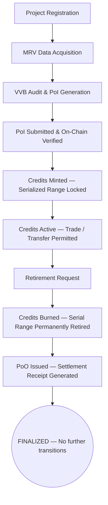

# RFC-001: Two-Proof Model (PoI / PoO)

**Status:** Draft  
**Created:** 2026-04-14  
**Author:** @PrabhatKarlekar  
**Related Issues:** #TBD  
**Target Phase:** Year 0-1

---

## 1. Problem Statement

Traditional carbon markets conflate four distinct lifecycle events into a single ambiguous unit:

- **Issuance** — a credit is created
- **Trading** — a credit changes hands
- **Retirement** — a credit is consumed
- **Reporting** — a claim is made

This conflation causes:
- **Double counting** — the same emissions reduction claimed by multiple entities
- **Phantom credits** — credits issued for reductions that never occurred
- **Zombie credits** — retired credits with no verifiable settlement receipt
- **Post-facto revocation ambiguity** — no clear mechanism to invalidate bad credits without system-wide rollback
- **Greenwashing** — offset claims made without cryptographic evidence of consumption

Current registries (Verra, Gold Standard, CDM) address these problems through manual audit processes and centralized databases. This approach does not scale to millions of small projects, does not support programmatic verification, and does not produce machine-verifiable claims.

> [!CAUTION]
> **The core problem:** Credit legitimacy (does this credit have the right to exist?) and credit consumption (has this credit been permanently used?) are never formally separated at the protocol level.

---

## 2. Proposed Solution

Introduce the **Two-Proof Model** — a protocol-level separation of credit existence from credit consumption via two distinct cryptographic objects:

- **Proof-of-Integrity (PoI)** — a minting permit. Proves a credit has the right to exist.
- **Proof-of-Offset (PoO)** — a settlement receipt. Proves a credit has been permanently consumed.

> [!IMPORTANT]
> **Core principle:** `Registry > Market`
> The registry controls existence. Markets discover price. These must never be conflated.
> 
> No credit can exist without a valid PoI.  
> No offset claim is valid without a PoO.  
> These are not simply state flags — they are cryptographic objects with independent verifiability.

---

## 3. Definitions

### 3.1 Proof-of-Integrity (PoI)

A cryptographic attestation generated by an accredited Validation and Verification Body (VVB) that proves:
- The project exists and is registered
- MRV (Measurement, Reporting, Verification) data has been independently audited
- The claimed emissions reduction is mathematically valid under an approved methodology
- The serialization range is bounded and has not been previously issued
- The credit quantity does not exceed the verified reduction

> [!NOTE]
> PoI is the **minting permit**. No credits may be minted without a valid, on-chain-verified PoI.

**PoI Object Structure (Phase Alpha):**

```json
{
  "proof_type": "PoI",
  "inputs": {
    "project_id": "PRJ-123",
    "project_status": "REGISTERED",
    "mrv_mode": "CONTINUOUS",
    "timestamp": "2026-01-01T12:00:00Z",
    "vvb_signature": "0x7a8f...",
    "methodology_hash": "SHA256(VM0042)",
    "data_root": "0xMerkleRoot...",
    "serialization_range": "0-1000000",
    "amount_tCO2e": 1000000,
    "jurisdiction": "IN",
    "market_scope": "VCM"
  },
  "output": {
    "credit_id": "CC-789",
    "valid_from": "2026-01-01T00:00:00Z",
    "valid_until": "2026-12-31T23:59:59Z",
    "zk_proof": "0x123abc...",
    "cc_mint_amount": 1000000,
    "owner": "0xWalletAddress",
    "status": "VALID"
  }
}
```

*In Phase Alpha, `zk_proof` is replaced by a mock boolean `poi_valid: true`. Full ZKP integration is deferred to Phase Beta (see Section 8).*

### 3.2 Proof-of-Offset (PoO)

A cryptographic receipt generated by the registry at the moment of credit retirement (burn) that proves:
- Specific serialized credits have been permanently removed from circulation
- The burn is irreversible — no re-entry path exists
- The beneficiary entity is recorded on-chain
- The claim cannot be transferred to another entity

> [!NOTE]
> PoO is the **settlement receipt**. No offset claim (corporate net-zero, compliance, PAYG) is valid without a corresponding PoO.

**PoO Object Structure:**

```json
{
  "proof_type": "PoO",
  "inputs": {
    "project_id": "PRJ-123",
    "credit_id": "CC-789",
    "serialization_range": "0-999",
    "market_scope": "VCM",
    "cc_amount": 1000
  },
  "output": {
    "burn_tx_hash": "0x998877...",
    "timestamp": "2026-06-01T12:00:00Z",
    "beneficiary": "Corporate_Entity_X",
    "owner": "0xWalletAddress",
    "claim_type": "Corporate_NetZero",
    "zk_proof": "0x123abc...",
    "amount_tCO2e": 1000,
    "status": "FINALIZED"
  }
}
```

**PoO is by design:**
- Non-transferable
- Non-revocable once finalized
- Unique per retired serial range
- Independently verifiable without registry operator involvement

---

## 4. State Machine

Every credit follows a strict, one-directional lifecycle. No backwards transitions exist.



> [!WARNING]
> **Invalid transitions (enforced by state machine):**
> - `RETIRED → ACTIVE` — Impossible
> - `ACTIVE → MINTED` — Impossible (no re-mint)
> - `FINALIZED → any state` — Impossible
> - `Mint without PoI` — Transaction reverts

---

## 5. Core Invariants

These invariants are enforced at the protocol level and must hold in every implementation phase.

- **Invariant 1 — PoI is mandatory for minting:** No credit token may be created without a valid, verified PoI referencing the credit's serialization range.
- **Invariant 2 — Supply bound:** Credits minted from a PoI must satisfy: `Q_mint ≤ Q_auth` where `Q_auth = PoI.output.cc_mint_amount`. Over-issuance is mathematically impossible, not just policy-restricted.
- **Invariant 3 — Serialization range uniqueness:** A serialization range, once locked by a PoI, cannot be assigned to any other project or batch. Range lock is permanent and checked against the Global Serial Registry before every mint.
- **Invariant 4 — Burn irreversibility:** A burned serial cannot be re-minted. The burn event is final. The Global Serial Registry marks burned ranges permanently.
- **Invariant 5 — PoO uniqueness:** Each serial range generates exactly one PoO. PoO cannot be issued twice for the same serials.
- **Invariant 6 — PoO non-transferability:** PoO is bound to the beneficiary at issuance. It cannot be transferred, traded, or reassigned to prevent double-claiming at the settlement layer.
- **Invariant 7 — PoI single-use:** Once a PoI is used to mint credits, its status is updated to `USED`. A `USED` PoI cannot authorize further minting.

---

## 6. Separation of Concerns

The Two-Proof Model enforces a strict architectural boundary:

| Layer | Responsibility | Cannot |
|-------|---------------|--------|
| **Registry** | Control existence, enforce lifecycle, issue PoI/PoO | Discover price |
| **Market/AMM** | Price discovery, liquidity, transfer | Mint, modify, or invalidate credits |
| **Application** | User interface, claims reporting | Bypass registry enforcement |

This enforces the **Registry > Market** principle. Market layers operate strictly on registry-issued assets.

---

## 7. Why PoO is an Object, Not a Flag

A retirement flag (e.g., `status: RETIRED`) has the following critical weaknesses:
- Disappears if the database is modified or migrated
- Cannot be exported or presented as standalone evidence
- Has no cryptographic binding to the beneficiary
- Cannot be independently verified by a regulator without registry access

> [!TIP]
> A PoO object, conversely, is a cryptographic receipt permanently recorded on-chain. It is portable, binds the beneficiary at issuance, persists forever independently, and contains the `burn_tx_hash`. A flag proves nothing to an external auditor; a PoO proves everything.

---

## 8. ZKP Decision (Phase Alpha Freeze)

> [!IMPORTANT]
> **Decision: ZKP integration is frozen for Phase Alpha.**

Phase Alpha will implement the Two-Proof Model with mock PoI validation (deterministic boolean). This allows the state machine, invariants, and data structures to be built and tested without ZKP complexity.

ZKP architecture will be resolved in Phase Beta. Open questions include:
1. zkSNARK (Groth16 / PLONK) vs zkVM (RISC Zero / SP1)?
2. On-chain proof verification vs commitment hash only?
3. Trusted setup requirement and ceremony logistics?

The Phase Alpha state machine is ZKP-agnostic by design.

---

## 9. Alternatives Considered

- **Option A — Retirement Flag Only (no PoO object):** Set `status: RETIRED` on credit burn. *Rejected because a flag has no evidentiary value and cannot be exported for regulatory purposes.*
- **Option B — Single Proof Model:** Combine PoI and PoO. *Rejected because legitimacy ≠ consumption. Combining them creates lifecycle ambiguity.*
- **Option C — Pure ERC-20 fungible tokens:** Use standard fungibles with a registry database. *Rejected because fungibility hides origin and usage history, enabling double counting.*
- **Option D — Pure NFT (ERC-721):** Issue one NFT per tCO₂e. *Rejected because gas costs and fragmentation make this impractical at scale.*

---

## 10. Open Questions

1. **Partial retirement semantics** — When a serial range is partially retired (e.g., serials 0–499 of range 0–999), does the remaining range (500–999) retain its original `credit_id` or receive a new one?
2. **PoI revocation** — Under what conditions (VVB misconduct, methodology error) can a VALID PoI be revoked? What happens to already-minted credits from a revoked PoI?
3. **Cross-jurisdiction credits** — How does the Two-Proof Model interact with Article 6 Corresponding Adjustments (CAs) when credits cross national registries?
4. **Vintage expiry enforcement** — Is expiry enforced at the registry level (credits auto-expire) or only at the application level (expired credits cannot be retired via UI)?

---

## 11. References

- `architecture/desgin_document_v2.pdf` — Sections 2, 3, 4 (full Two-Proof Model specification)
- `architecture/qna_document_v1.pdf` — Q23–Q27 (PoI/PoO definitions), Q14 (greenwashing prevention), Q16 (double counting prevention)
- UNFCCC Paris Agreement, Article 6 — Corresponding Adjustment requirements
- India Carbon Credit Trading Scheme (CCTS), 2023
- ERC-3525 Semi-Fungible Token Standard — https://eips.ethereum.org/EIPS/eip-3525

---

## 12. Implementation Notes (Phase Alpha)

**Location:** `src/core/`

**Rust state machine — Types to define:**
- `ProjectStatus`: `REGISTERED` | `ACTIVE` | `SUSPENDED` | `TERMINATED`
- `CreditStatus`: `ACTIVE` | `RETIRED` | `EXPIRED`
- `PoIStatus`: `VALID` | `USED` | `REVOKED`
- `PoOStatus`: `FINALIZED` | `REJECTED`
- `SerialRange`: `(u64, u64)` with uniqueness enforcement
- `PoI`: struct matching Section 3.1 (mock `zk_proof`: bool)
- `PoO`: struct matching Section 3.2
- `CarbonCredit`: struct matching Section 3 data structures
- `Registry`: state machine enforcing all invariants in Section 5

**Tests required:**
- Cannot mint without PoI
- Cannot mint beyond `cc_mint_amount`
- Serial range uniqueness — duplicate range reverts
- Burn is irreversible
- PoO issued exactly once per burn
- All invalid state transitions revert

**Dependencies:** None (Phase Alpha is pure Rust, no blockchain)
